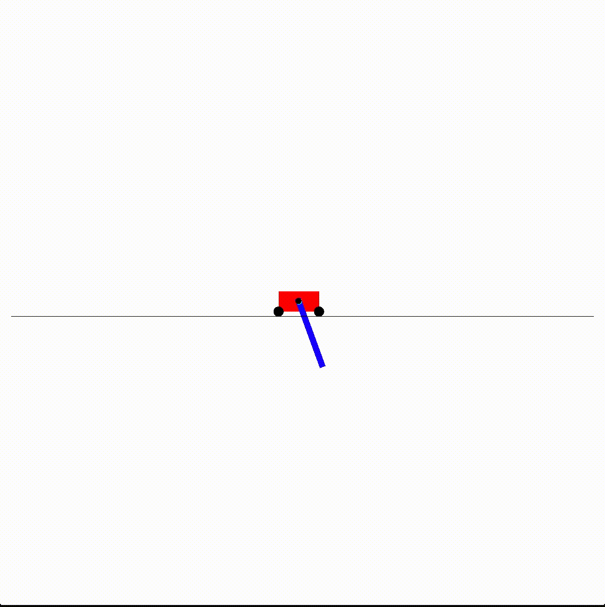

# Maximing Failure Diversity in Evolutionary Simulations

This repo contains code for the paper on Failure Diversity in Evolutionary Simulations, submited to ALife 2021.

----

Our goal is to study how we can use failure to guide evolution to display different behaviours and analyse the effects of focusing on failure as the control mechanisms in evolutionary systems. Here we evolve neural networks that maximise the variety of failures in simulated agents trying to solve a task. As a fitness function, we use the variance of the performances of a "family" of agents in an environment with potentially infinite reward. In effect, we are optimising for a set of behaviours that lead to different ways to fail at the task. We find that Failure Diversity Maximisation (fdm) results in behavioral diversity in agents sharing the same network topology. This includes agents that perform as well as agents purely optimised for performance. Our results mimic an often overlooked aspect of evolution: agents do not only optimise one behaviour but expand to the limits of their behavioural possibilities.

## Table of contents
* [Technologies](#technologies)
* [Training an agent](#Training)
* [Gifs](#Gifs)
* [Code for visualisation](#Visualisation)

### Technologies 

This tool relies on Weight Agnostic Neural Networks (https://github.com/google/brain-tokyo-workshop/tree/master/WANNRelease), by Adam Gaier and David Ha.

This project is implement in **Python3** and uses the libraries:

1. NumPy (pip3 install numpy)
2. mpi4py 3.0.1 (pip3 install mpi4py)
3. OpenAI Gym 0 (pip3 install gym)

### Training

To train an agent, first move to folder fmd/fmd_code

- Using our Failure Diversity Maximisation (fdm)
-- python3 fmd_train.py -p p/swingup_fdm.json -n 1 -o output
- fdm and Novelty Search (ns)
-- python3 fmd_train.py -p p/swingup_fmd_and_ns.json -n 1 -o output
- Novelty Search
-- python3 fmd_train.py -p p/swingup_ns.json -n 1 -o output
- WANN - our baseline
-- python3 fmd_train.py -p p/swingup_wann.json -n 1 -o output

Where:
p/swingup_method_name.json are the parameter file, -n defines the number of cores to use for parallel execution and -o tells the name of the output files.

For more information on the parameters, [check the paper]()

### Gifs

Failure Diversity Maximisation (fdm)

  </img>

Failure Diversity Maximisation and Novelty Search

  </img>

Novelty Search

  </img>

WANN

  </img>

### Visualisation

To run the code to generate the images access this [jupyter notebook](fmd/fmd_code/Visualization_Comparison.ipynb).

